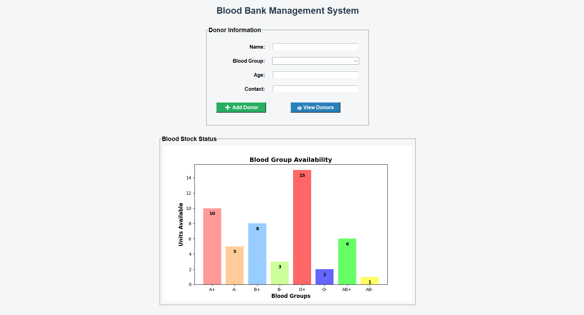

# 🩸 Blood Bank Management System

<div align="center">

[](https://www.python.org/downloads/)
[](https://docs.python.org/3/library/tkinter.html)
[](LICENSE)
[](https://github.com/Rohitkr2002/Blood-Bank-Management-System)

*A comprehensive GUI-based Blood Bank Management System built with Python and Tkinter*

</div>

---

## 📋 Overview

A professional-grade Blood Bank Management System designed to streamline blood bank operations. This application allows blood banks to efficiently manage donor information, track blood inventory, and visualize stock levels in real-time using interactive charts.

**Key Technologies:**
- **Backend:** Python 3.8+
- **GUI Framework:** Tkinter
- **Data Visualization:** Matplotlib
- **Database:** File-based storage system

---

## ✨ Features

### Core Functionality
- ✅ **Add New Blood Donors** - Register donors with comprehensive details (Name, Age, Blood Group, Contact Info)
- ✅ **Real-time Blood Stock Visualization** - Interactive bar charts showing available blood inventory by group
- ✅ **Donor Management** - View, update, and manage complete donor records in a live-updating table
- ✅ **Quick Donor View** - Modal popup window for viewing detailed donor information
- ✅ **Input Validation** - Comprehensive validation and confirmation messages for data integrity
- ✅ **User-Friendly Interface** - Intuitive and responsive GUI design for easy navigation

### Technical Features
- 📊 Real-time data visualization with Matplotlib
- 🔒 Input validation and error handling
- 💾 Persistent data storage
- 🎨 Professional UI with Tkinter
- ⚡ Fast and efficient data operations

---

## 🛠️ Installation

### Prerequisites
- Python 3.8 or higher
- pip (Python package manager)

### Step-by-Step Installation

1. **Clone the Repository**
   ```bash
   git clone https://github.com/Rohitkr2002/Blood-Bank-Management-System.git
   cd Blood-Bank-Management-System
   ```

2. **Install Required Dependencies**
   ```bash
   pip install -r requirements.txt
   ```

3. **Run the Application**
   ```bash
   python BloodBank.py
   ```

---

## 📁 Project Structure

```
Blood-Bank-Management-System/
├── BloodBank.py              # Main application file
├── requirements.txt          # Project dependencies
├── README.md                 # Documentation
└── project-Output.png        # Application screenshot
```

---

## 🖥️ GUI Preview

<div align="center">



*Main application interface with donor table and real-time blood stock visualization*

</div>

---

## 📚 Usage Guide

### Adding a New Donor
1. Click on **"Add New Donor"** button
2. Fill in the donor details:
   - Name
   - Age
   - Blood Group (A+, A-, B+, B-, O+, O-, AB+, AB-)
   - Contact Information
3. Click **Confirm** to save the donor
4. Success message will appear upon successful entry

### Viewing Donor Records
- All registered donors are displayed in the **Donor Information Table**
- Click on any donor row to view detailed information
- Table updates in real-time after each new entry

### Checking Blood Stock
- **Real-time Bar Chart** displays current blood inventory by type
- Visual representation helps identify low stock blood groups
- Chart updates automatically as blood stock changes

---

## 💻 Technical Details

### Built With
- **Tkinter** - Cross-platform GUI development
- **Matplotlib** - Data visualization and charting
- **Python Standard Libraries** - File handling and data management

### Architecture
The application follows a modular design with:
- **GUI Components** - Organized Tkinter widgets for user interface
- **Data Management** - Structured storage and retrieval system
- **Visualization** - Matplotlib integration for real-time charts

---

## 🚀 Future Enhancements

- [ ] Database integration (MySQL/PostgreSQL)
- [ ] Advanced analytics and reporting
- [ ] User authentication system
- [ ] Blood donation scheduling
- [ ] Export/Import data functionality
- [ ] Mobile app integration
- [ ] Email/SMS notifications
- [ ] Donor history and blood donation tracking

---

## 📊 System Requirements

| Requirement | Specification |
|---|---|
| **Python** | 3.8 or higher |
| **RAM** | Minimum 2GB |
| **Disk Space** | Minimum 100MB |
| **OS** | Windows, macOS, Linux |

---

## 🤝 Contributing

Contributions are welcome! Here's how you can help:

1. Fork the repository
2. Create a feature branch (`git checkout -b feature/AmazingFeature`)
3. Commit your changes (`git commit -m 'Add some AmazingFeature'`)
4. Push to the branch (`git push origin feature/AmazingFeature`)
5. Open a Pull Request

### Code Guidelines
- Follow PEP 8 style guide
- Add comments for complex logic
- Write descriptive commit messages
- Test your changes before submitting PR

---

## 📝 License

This project is licensed under the MIT License - see the [LICENSE](LICENSE) file for details.

---

## 👨‍💻 Author

**Rohit Kumar**
- GitHub: [@Rohitkr2002](https://github.com/Rohitkr2002)
- Portfolio: [Your Portfolio Link]
- LinkedIn: [Your LinkedIn Profile]

---

## 🙏 Acknowledgments

- Thanks to the Python and Tkinter communities
- Matplotlib for excellent visualization tools
- Blood bank professionals for domain knowledge

---

## 📞 Support

If you encounter any issues or have suggestions:
1. Check existing [Issues](https://github.com/Rohitkr2002/Blood-Bank-Management-System/issues)
2. Create a new issue with detailed description
3. Contact via email

---

## 📌 Roadmap

- **v1.0** ✅ Basic blood bank management functionality
- **v1.1** 🔄 Enhanced UI/UX improvements
- **v2.0** 🚀 Database integration
- **v3.0** 📱 Mobile app version

---

<div align="center">

**Made with ❤️ by Rohit Kumar**

[⬆ Back to Top](#-blood-bank-management-system)

</div>
